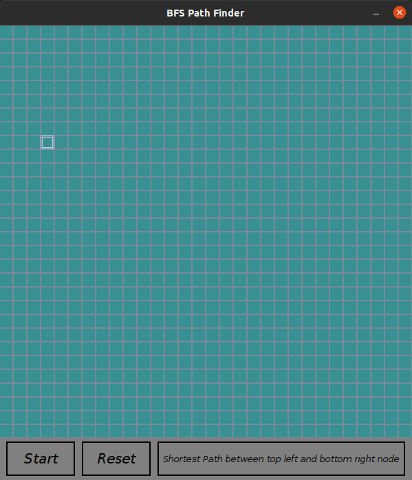

# BFS-Path-Finder
Finds the path between the top left and bottom right node if it exists using BFS Algorithm and Java Swing.

Windows users may expericence issues with the size of the Frame.

<a href = "https://youtu.be/G_5D5MyGhR0">Click here to see a Demo on YouTube</a>

